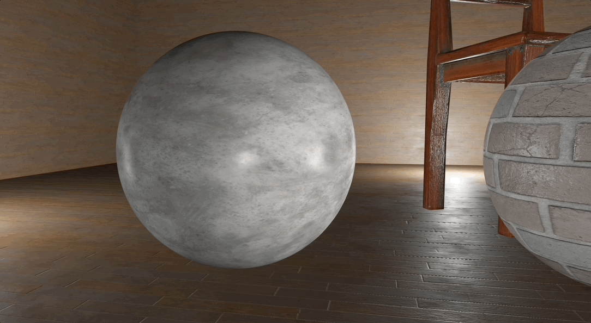

# KTH Graphics Bonus Project - Comparing Phong, Blinn-Phong and Cook-Torrance Illumination Models

This is my bonus project for my Computer Graphics and Visualisation course at KTH.

# Illumination models on spheres

# Cook-Torrance

# Phong Vs Blinn-Phong

